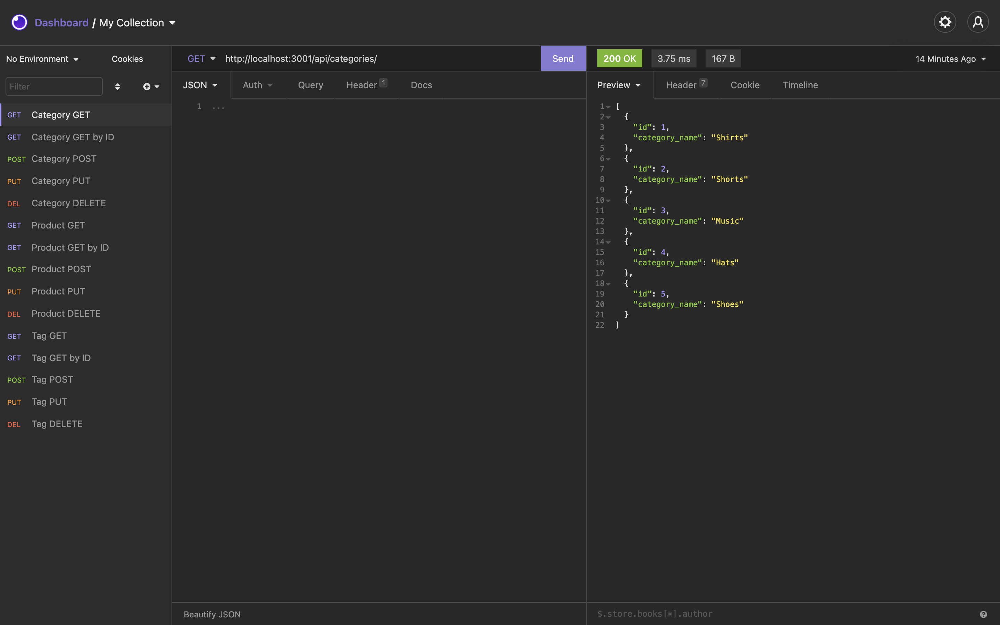

# E-Commerce Backend

## E-Commerce Backend Description

This application is designed to assist business owners in keeping track of fluctuating inventory through the use of MySQL2, Sequelize, and Express. By keeping track of products, categories, and tags, business managers can optimize their supply chain. Recommended application to use is Insomnia or Postman. Future development will prioritize a more friendly UI/UX.

## Using application

To use this application, refer to this video: https://watch.screencastify.com/v/rmvg77u71rnMDazOKUAn

## Installing application

To install this application, either clone this repository or download directly through a zip file. Ensure you're running it on VS-Code. Make sure to use npm to install all necessary packages (mysql2, sequelize, express). Start through using the "node server.js" command.